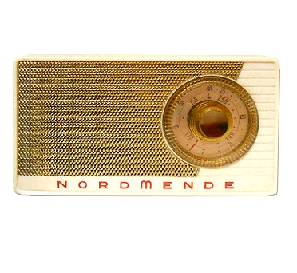
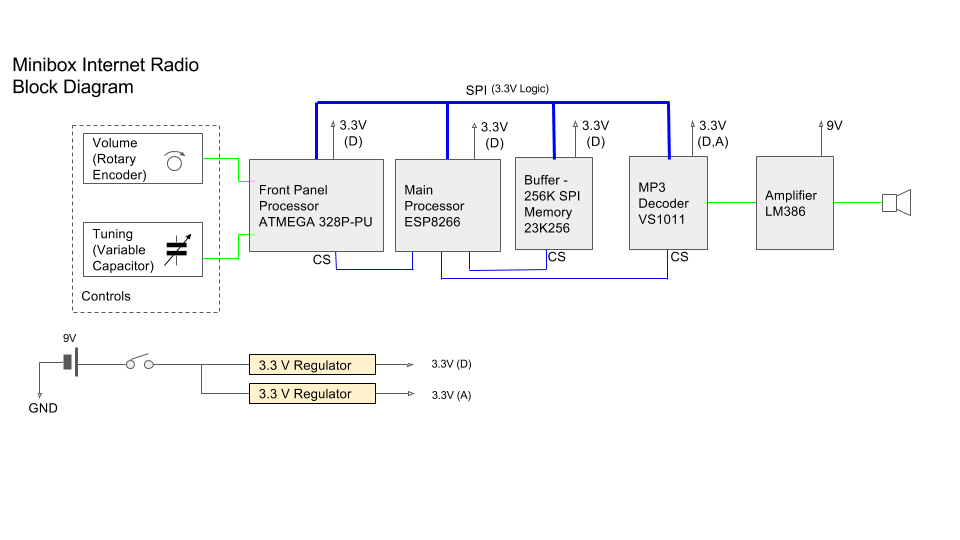

# InternetRadioMinibox

## Summary
Hardware and software for the Nordmende Minibox conversion to an internet radio

## Description
This is a project to develop and internet radio that can be fitted into an old Nordmende Minibox radio. These radios were produced in the late 50’s to early 60’s  and used a 6 transistor superheterodyne circuit. The version I have is from 1959:

## Circuit

A block diagram for the circuit is:

The detailed circuit diagrams (in [KiCAD](http://kicad-pcb.org/) format) are [here](hardware/kicad/InternetRadioMinibox).

## Release History
**v0.01-breadboard** is a breadboard version (i.e. pre-release). Uses VS1053 breakout board. Uses ATMEGA 328 as front panel controller (missing band switch). No SPI connection between front panel controller and main processor (ESP8266).
